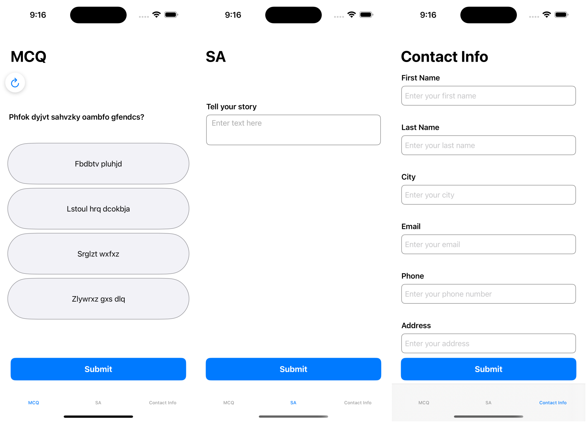

# Intro
Question Demo using IGListKit

Example of two ways to implement a Single Choice Question Page rendering:

1) 1 Section Controller + homogeneous array of Page VMs
2) 2 Section Controllers + heterogeneous array of Question vm and its Options vms

Each example also contains a solution of how to communicate back the selection of any option, storing it in an Answer model, and simulate the Answer submission.

# TODO

- [x] Add error message to `PageViewModel`
- [x] Add "Submit" button to both VCs to defer the submission, allowing user to first pick an option, and later submit it
- [ ] Implement business logic to record an Answer while user is making a choice
- [ ] Implement logic of validating the page, after user presses "Submit" button
- [x] Display an Error message, when user pressed "Submit" without selecting any of the options 
